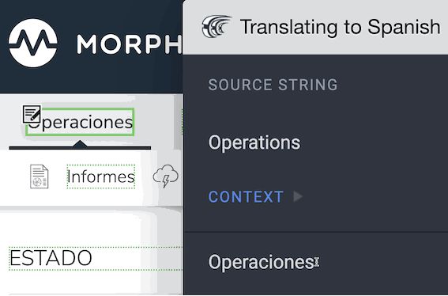

# morpheus-crowdin-plugin
The Morpheus UI Localization Plugin.

This Plugin is used to help translators localize Morpheus UI strings.

The Morpheus UI Crowdin Plugin enables translators to review and edit Morpheus translations stored within the Morpheus Crowdin project, directly within the Morpheus UI. Translations that are created/edited through the Plugin are saved back to the Crowdin platform and will be built into the next Morpheus UI release. With the Plugin enabled, users can navigate the Morpheus UI as usual and can quickly jump in and out of the Crowdin context

All of the Morpheus UI Strings that can be localized are hosted on the centralized Crowdin platform in the “morpheus” project. Users who wish to provide translations for Morpheus in their chosen language(s) can be granted access to the Crowdin platform where they can provide their translations. All translation activity is saved into the Crowdin platform and the Morpheus Translation Memory. 

For more information and a how-to guide please see here: https://support.morpheusdata.com/scormanywhere__SCORM_Player?inline=1&courseId=a7P4N000000KQy7UAG

